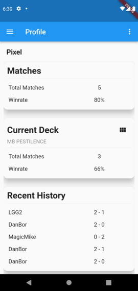

# Congrega
Congrega is an opensource app ready to support you during your hardest *Magic: The Gathering* matches.

# Overview 

+ **Accademic Year**: 2019-2020
+ **Project Title**: A peer-to-peer matchup app.
+ **Student**: Riccardo Malavolti
+ **CFUs**: 6

Card games such as Magic the Gathering has a strong and passionate comunity, which is very active in the form of tournaments and parties. Official and sanctioned events are organized by shops and regional comunities, using software provided by Wizards of The Coast (the company owner of MtG). For non-official/private events - hosted in a shop or in a private location - there are some free tools: AetherHub provides a browser-based organizer, but as many other services, lacks of interactivity.

Congrega tries to help MtG players to reach some fundamentals goals: tracking life points and counters during a match and keeping a log of the results. Users should be challenged by their opponents, and not from this app. Simplicity is a key factor, all the functionalities must be easy to access and easy to interact with, without requiring too much attention from the player.

Congrega targets mobile devices (smartphones and tablets) but it can be easily extended to a web application thanks to Flutter, paving the way to more complex and convoluted features.

# Tools and Techniques

- **Flutter**: a cross-platform framework capable of building apps for iOS, Android, Linux, Windows and web apps.
- **Arcano**: a custom server specifically desingned for *Congrega*.

# Expected Outcomes

Congrega must be a silent and efficent helper, interactions must be simple and intuitive. It is expected to:

 - Simplify the life points tracking, providing an easy yet complete interface. 

 - Keep track of player's progress, recording performances such victories, losses and such.

# Project Documents

- Report: TBD
- Presentation: TBD

# Bibliography

 - Flutter website: [https://flutter.dev/](https://flutter.dev/)
 - Arcano repository: [https://github.com/rickie95/arcano](https://github.com/rickie95/arcano)
 - ["Why the confirmation password must die"](https://uxmovement.com/forms/why-the-confirm-password-field-must-die/) an interesting (and maybe controversial) take on a useless and frustrating field.

# Screenshots

  